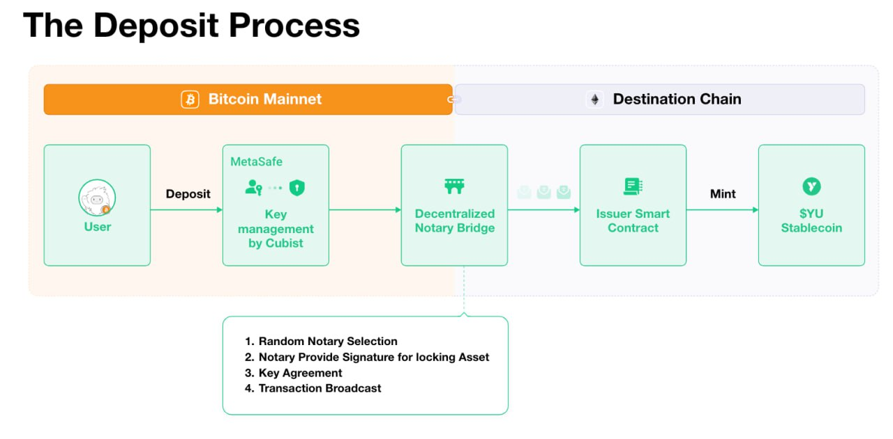

# Implementation of the Yala Bridge

The Yala Bridge allows users to deposit Bitcoin and receive yBTC, a tokenized representation of Bitcoin on the Yala platform. This token, yBTC, can then be used as collateral within the Yala ecosystem, allowing users to mint $YU, Yala’s Bitcoin-backed stablecoin, across different blockchain environments, including EVM and non-EVM chains. This process not only facilitates cross-chain liquidity but also broadens the accessibility of Bitcoin in DeFi, making it possible for users to participate in yield-generating activities, lending, and more diverse DeFi strategies.

The bridge is secured by a Decentralized Notary Bridge and MetaSafe Key Management powered by Cubist, ensuring a secure, transparent, and decentralized asset transfer process.

### How the Yala Bridge Works 

#### 1. BTC Deposit & Key Management

* Users initiate the process by depositing BTC into Yala’s MetaSafe.
* Key management is handled by Cubist, a secure cryptographic solution that ensures asset custody is protected against single points of failure.

#### 2. Decentralized Notary Bridge Validation

* **Random Notary Selection:** The system selects a VRF-based random notary to process the transaction.
* **Signature Verification:** The notary provides a cryptographic signature to confirm asset locking.
* **Key Agreement:** Secure multi-party computation (MPC) ensures private key management remains trustless.
* **Transaction Broadcast:** The deposit transaction is finalized on the Bitcoin network, and a message is relayed to the destination chain.

#### 3. Issuance of yBTC on Destination Chain 

* Once the Notary Bridge verifies the deposit, an Issuer Smart Contract mints yBTC on the selected destination chain.
* This yBTC acts as a tokenized representation of Bitcoin, allowing users to access DeFi applications.

#### 4. Minting $YU Stablecoin

* Users can use yBTC as collateral to mint $YU within the Yala protocol.
* $YU is then usable across DeFi ecosystems, enabling payments, staking, and liquidity provision.

<figure><figcaption>
Yala Bridge
</figcaption></figure>

## Security & Decentralization of the Yala Bridge 

The Yala Bridge prioritizes security, decentralization, and composability through key design elements:

### MetaSafe Key Management (Cubist)

* Utilizes secure enclaves and multi-party computation (MPC) to protect private keys.
* Removes single points of failure and enhances institutional-grade custody.

#### Attack Prevention:

* **Single Point of Failure Mitigation:** Unlike traditional custody solutions, where a single compromised private key can result in loss of funds, MPC ensures that multiple entities must collaborate to authorize transactions.
* **Man-in-the-Middle (MitM) Attacks:** Secure enclaves protect private key operations, preventing MitM attacks from intercepting key usage.
* **Insider Attacks:** Since no individual has full access to a private key, even an insider with privileged access cannot sign transactions alone.
* **Key Extraction Attacks:** Even if an attacker gains system-level access, MPC ensures that the fragmented key shares remain useless in isolation.

### Decentralized Notary Bridge

* Validators operate independently, ensuring decentralized transaction verification.
* Notary selection is randomized, preventing centralization risks.
* Uses multi-signature validation to approve BTC deposits before minting yBTC.

#### Attack Prevention:

* **Centralization Risks:** By using VRF-based selection and rotating notaries, no single entity can take over the bridge validation process.
* **Validator Collusion:** The multi-signature requirement ensures that even if some validators attempt fraud, they would need a majority to execute an attack, which is costly and detectable.
* **Double Spending Attacks:** The notary system verifies BTC deposits before minting yBTC, preventing replay or forged deposit claims.

### Robust Smart Contract Security

* The Issuer Smart Contract ensures that yBTC is only minted when BTC deposits are properly validated.
* Cross-chain messaging protocols prevent double issuance and unauthorized minting.
