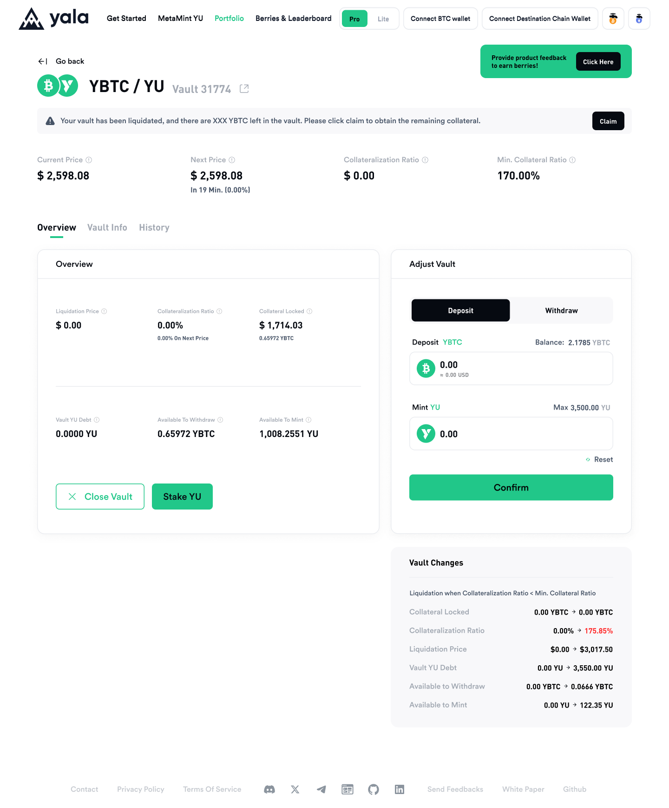

# Liquidation

When the price of your assets falls below the collateral price, a liquidation process will be initiated.

1\. Your assets will first be confiscated to start the auction, and the transaction history will reflect the auction initiation. The entire process will be executed automatically.

2\. Your assets will then be auctioned, and any remaining assets (if applicable) will be returned to you.&#x20;

3\. Once finished, you will need to navigate to the transaction history and click on the corresponding position, which will bring you to the vault page.

<figure><figcaption></figcaption></figure>

4\. Click the "Claim" button on the Vault page to retrieve your remaining assets. Once the auction is finished, you can start clicking "Claim." If the auction has not ended, the user cannot claim. Please note that gas fees will be required for this process.

<figure><figcaption></figcaption></figure>

5\. Wait for the transaction to complete, and your remaining YBTC will be returned to your wallet. The details of the process are available in the transaction history.

<figure><figcaption></figcaption></figure>
