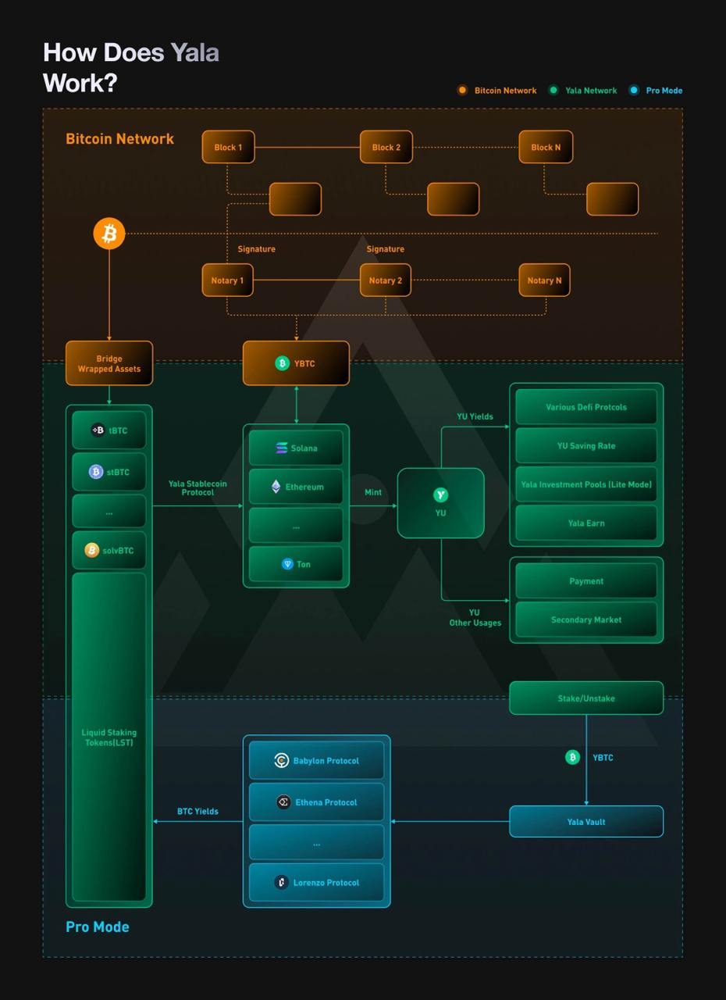

# Yala Architecture

The Yala protocol is an innovative DeFi platform that bridges Bitcoin liquidity across multiple ecosystems.&#x20;

<figure><figcaption></figcaption></figure>

The architecture is divided into three interconnected sections.

**Bitcoin Side:** On the Bitcoin side, the focus is on the Notary Bridge, which utilizes cryptographic signatures to mint **yBTC**. This tokenized version of Bitcoin is crucial for bridging assets into the Yala Network.

**Yala Network:** **yBTC** flows into the Yala ecosystem, where it acts as collateral on different ecosystems. Within the Yala Network, users can mint the stablecoin **$YU**. Once minted, **$YU** can be utilized across various DeFi protocols for yield generation. The Yala Network also offers additional opportunities for users to earn yields through options like **YU Savings Rate**, **Yala Earn**, **staking**, **payments**, and participation in **secondary markets**.

**Pro Mode:** On the Pro Mode side, advanced users leverage **yBTC** within the **Yala Vault**. This allows them to access Bitcoin Layer 2 (L2) solutions like **Babylon, Ethena Protocol**, and **Lorenzo Protocol**. In this mode, users can generate additional yield through liquid staking tokens while maintaining exposure to **Bitcoin**.

### Core  Components

* Vaults Module: Manages over-collateralization and collateral for each user.
* Minting Module: Handles the $YU creation process.
* Liquidation Module: Ensures system solvency through automated liquidations when necessary.
* Keepers and Oracles: Maintain stability and provide up-to-date price data for collateral assets.
